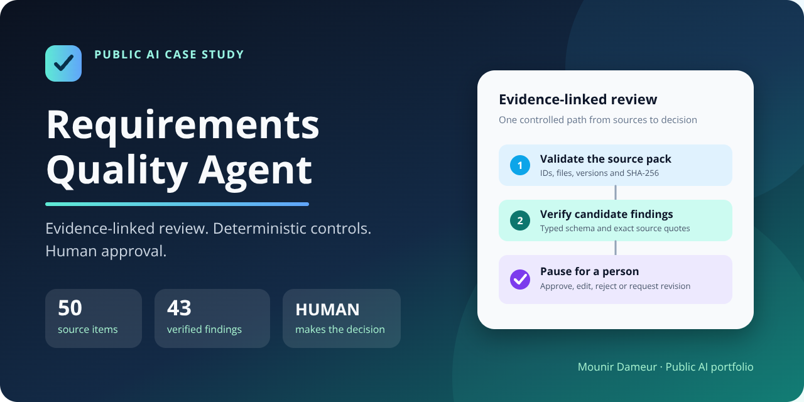
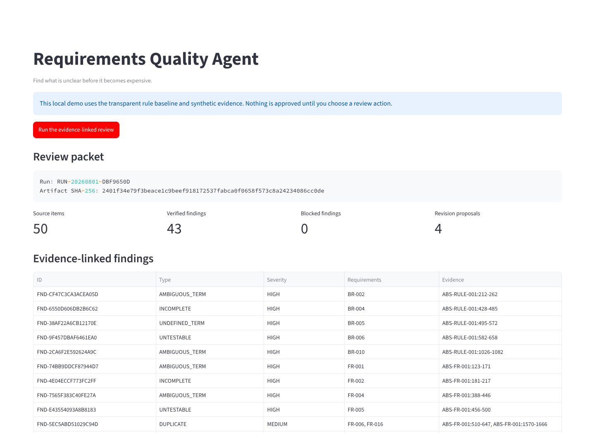
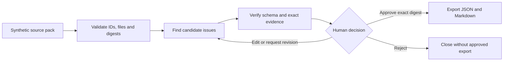
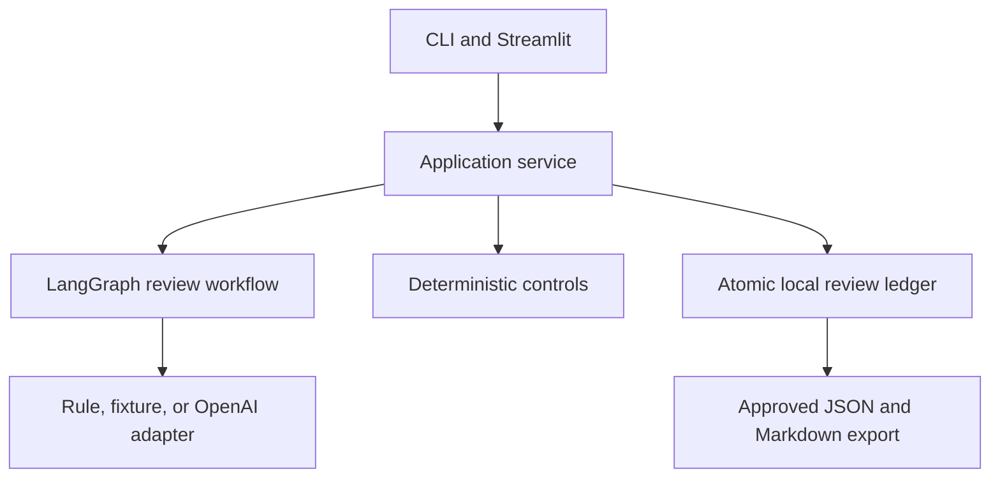

# Requirements Quality Agent



[](https://github.com/DameurMounir/requirements-quality-agent/actions/workflows/ci.yml)

[](LICENSE)
[](DATA_LICENSE.md)

**Find unclear, contradictory, duplicated, incomplete, or untestable
requirements before they become expensive delivery problems.**

This public case study turns a fictional customer-onboarding evidence pack into
an exact, source-linked review packet. A model or transparent rule adapter may
suggest findings and revisions; deterministic controls verify the evidence;
only a person can approve, edit, reject, or request another review.

> **Decision question:** Is this information clear, consistent, and testable
> enough to build from?

## See the working result



The captured local run used the provider-free rule adapter. It reviewed the
frozen synthetic pack and paused before any approval:

| Measured observation | Result |
|---|---:|
| Source items | 50 |
| Items intentionally flawed / clean | 40 / 10 |
| Exact normalized findings | 43 |
| Findings blocked by evidence controls | 0 |
| Draft revision proposals | 4 |
| Automated tests | 179 passed |
| Branch-aware test coverage | 93.06% |

These figures describe this repository and its frozen fictional case. The
perfect rule-baseline score is deliberately case-tuned and is **not** an AI
accuracy claim. The optional OpenAI adapter is implemented, but its live
evaluation remains [`NOT_RUN`](evaluation/results/openai-adapter.md).

## One visible example

The pack contains these two statements:

| Source | Exact statement |
|---|---|
| `FR-008` | “The portal shall activate every standard-risk account automatically after document validation.” |
| `BR-001` | “Every new account must receive manual approval from a Risk Reviewer before activation.” |

The review identifies one candidate contradiction, retains both exact source
quotes, marks it `CRITICAL`, and asks a person which rule should govern. It does
not silently choose a business policy.

## How the review works



The design separates three kinds of authority:

| Lane | Responsible for | Cannot do |
|---|---|---|
| Model, rule, or fixture | Suggest issue candidates, questions, and clearer wording | Approve, write source files, or perform external actions |
| Deterministic controls | Validate paths, manifests, schemas, citations, digests, state, and exports | Invent meaning or accept business risk |
| Human reviewer | Approve, edit, reject, or request revision | Reuse a stale decision against a changed artifact |

Every accepted decision is bound to the run ID, artifact SHA-256, review round,
reviewer ID, and a one-use nonce. Editing a proposal changes the digest and
forces a fresh review round.

## Run it locally

Prerequisites: Python 3.12 or 3.13 and
[`uv`](https://docs.astral.sh/uv/getting-started/installation/).

```bash
git clone https://github.com/DameurMounir/requirements-quality-agent.git
cd requirements-quality-agent
uv sync --all-extras --group dev
uv run requirements-quality-agent --repo . validate
uv run streamlit run src/requirements_quality_agent/presentation/streamlit_app.py
```

The default demonstration is local, provider-free, and uses only committed
synthetic evidence. It requires no API key.

### Command-line review

```bash
uv run requirements-quality-agent --repo . analyze \
  --provider rule \
  --run-id RUN-DEMO-001

uv run requirements-quality-agent --repo . show \
  --run-id RUN-DEMO-001

uv run requirements-quality-agent --repo . review \
  --run-id RUN-DEMO-001 \
  --action APPROVE \
  --comment "Approved for the synthetic demonstration."
```

The review command also accepts `EDIT`, `REQUEST_REVISION`, and `REJECT`.
Approved reports are written under ignored local output directories; source
evidence is never edited in place. See the
[complete quick start](docs/04-working-vertical/quickstart.md).

## Analysis adapters

| Adapter | Purpose | Release evidence |
|---|---|---|
| `rule` | Transparent, provider-free demonstration tuned to this case | Reproducibly evaluated |
| `fixture` | Stable offline integration and failure-path testing | Excluded from quality scoring |
| `openai` | Optional typed Responses API interpretation | Implemented and fake-client tested; live evaluation `NOT_RUN` |

The live adapter has no tools, receives no answer key, cannot approve anything,
and fails closed if the provider response does not match the typed schema. Add
the `openai` extra and provide your own API key only when you intentionally want
to run it; never commit a key.

## Evaluation without inflated claims

The public answer key is used only by the evaluator, not by runtime adapters.
For the frozen case, the rule baseline produced 43 true positives, zero false
positives, and zero false negatives after mirrored pair labels were normalized.
That result proves agreement with one locked, synthetic answer key—not
generalization to unseen documents.

Reproduce the result:

```bash
uv run python scripts/evaluate_rule_baseline.py
git diff --exit-code -- evaluation/results
```

Read the [full evaluation method](docs/05-evaluation/method-and-gates.md),
[rule-baseline result](evaluation/results/rule-baseline.md), and
[adversarial scenario matrix](evaluation/adversarial-scenarios.md).

## Architecture and controls



Important boundaries:

- fully synthetic `AtlasBridge Services` case data;
- no private company material, production data, external writes, deployment, or
  source-document mutation;
- exact-quote citation resolution before a finding can be trusted;
- explicit workflow states and fail-closed provider, storage, and export paths;
- path traversal, symlink, replay, stale-digest, tampered-history, and concurrent
  decision tests;
- read-only GitHub Actions permissions with no model secret or deployment job;
- reproducible schemas, fixtures, evaluation results, and package inspection.

The reviewer identity in this local demonstration is an integrity binding, not
enterprise authentication or an electronic signature. This is a portfolio
case study, not a production approval service.

## Six-branch public method

The milestone branches preserve how the project was reasoned about and built:

| Branch | Public proof |
|---|---|
| `01-case-and-evidence` | Fictional problem, 50-item source pack, manifest, and locked answer key |
| `02-analysis-models` | Stakeholders, process, issue taxonomy, decisions, and traceability |
| `03-agent-design` | Typed workflow, adapter boundaries, evidence controls, and human authority |
| `04-working-vertical` | Complete analyze → review → decide → export journey |
| `05-evaluation` | Honest metrics, adversarial tests, CI, security, and distribution gates |
| `06-public-case-study` | This visual README, verified interface capture, and concise public story |

The final product is intentionally one controlled vertical—not a collection of
agents created for appearance.

## Project map

| Path | Contents |
|---|---|
| [`case/`](case/) | Frozen fictional evidence, expected labels, analysis models, and fixtures |
| [`src/requirements_quality_agent/`](src/requirements_quality_agent/) | Domain types, controls, workflow, adapters, storage, CLI, and UI |
| [`docs/`](docs/) | Problem, process, design decisions, controls, evaluation, and case study |
| [`evaluation/`](evaluation/) | Method inputs, adversarial scenarios, and generated results |
| [`tests/`](tests/) | Unit, integration, security, evaluation, and package proofs |
| [`.github/workflows/ci.yml`](.github/workflows/ci.yml) | Two-version quality and security gate |

## Limitations

- The published rule baseline is intentionally tuned to the frozen case.
- The live OpenAI adapter has not been evaluated in this release.
- The local reviewer ID is not identity verification.
- The application does not decide which business rule is correct.
- The release does not claim legal, regulatory, production, or universal
  requirements-quality fitness.

See the concise [public case study](docs/06-public-case-study/case-study.md) and
[five-minute demonstration script](docs/06-public-case-study/demo-script.md).

## Licence

Original software is licensed under [Apache License 2.0](LICENSE). Synthetic
case data and original documentation are licensed under
[CC BY 4.0](DATA_LICENSE.md).

