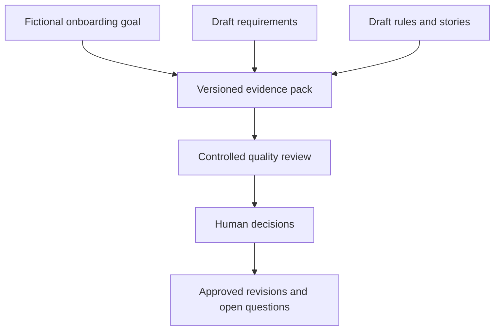

# Context and expected outcomes

## Case context

## Expected outcome

The public demonstration should make four things visible:

1. what the source actually says;
2. what quality problem is being alleged;
3. which deterministic checks support or block the finding; and
4. what a person decided about the proposed change.

## Initial release targets

| Measure | Gate |
|---|---:|
| Source files with verified digests | 100% |
| Parsed source items | 50 |
| Intentionally flawed items | 40 |
| Intentionally clean items | 10 |
| Machine-readable output schema validity | 100% |
| Published finding evidence-link validity | 100% |
| Unsupported critical findings published as confirmed | 0 |
| Precision on critical labeled issues | at least 0.85 |
| Recall on critical labeled issues | at least 0.90 |
| Automatic approvals | 0 |

Targets remain targets until branch 05 publishes measured results. A missing
or failed measurement may not be presented as success.

