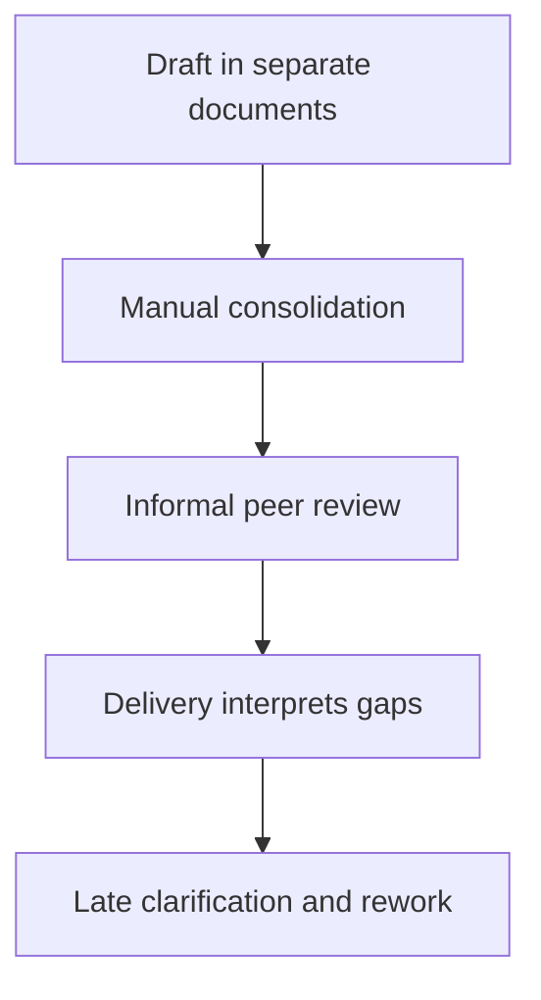
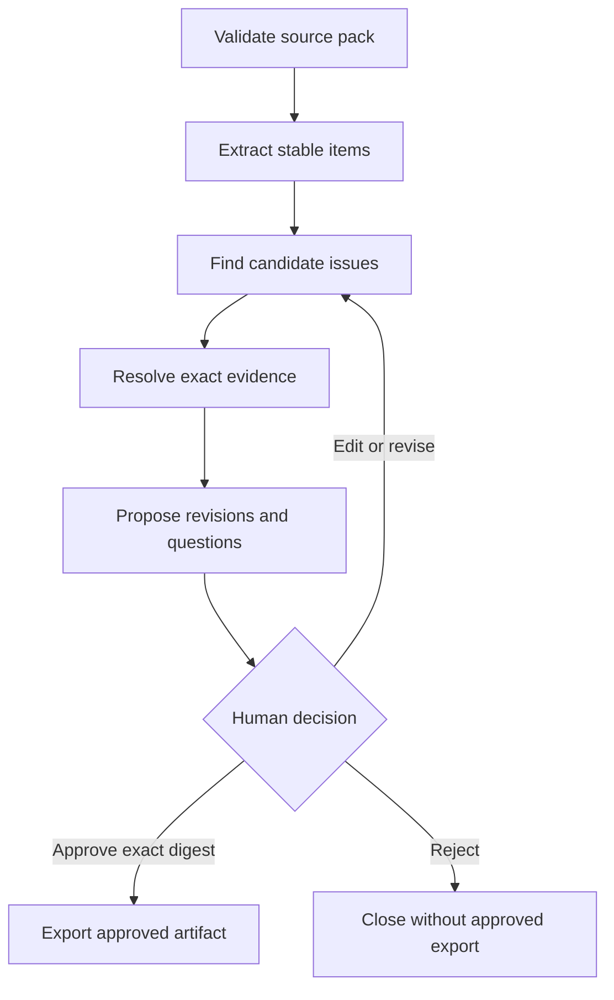

# Current and controlled review process

## Current pattern

| Pain point | Observable effect | Project response |
|---|---|---|
| Sources lose identity during consolidation | A reviewer cannot prove where wording originated | Immutable source IDs, versions, and digests |
| Review criteria vary by person | Similar issues receive inconsistent treatment | Public taxonomy and deterministic checks |
| Ambiguity becomes an implementation choice | Delivered behavior may not match intended behavior | Clarification questions and human approval |
| Conflicts are reviewed one document at a time | Incompatible rules survive local review | Cross-item candidate analysis |
| Revisions overwrite the original | Decision history becomes difficult to audit | Original, proposal, digest, and decision are separate |

## Controlled review pattern

The source pack is read-only throughout both processes. An export is a new
review artifact; it is never an in-place source modification.

