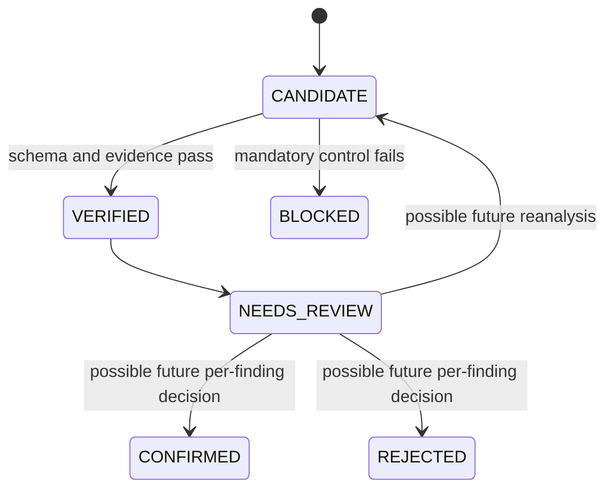

# Requirement and finding model

## Requirement structure

The review method examines the following elements when they are relevant:

| Element | Question |
|---|---|
| Actor | Who initiates or receives the behavior? |
| Trigger | What event starts the obligation? |
| Action | What must happen? |
| Object | What data, record, document, or state is affected? |
| Condition | Under which business condition does it apply? |
| Result | What observable outcome follows? |
| Measure | What threshold, time, unit, or tolerance determines success? |
| Exception | What happens when the normal path cannot complete? |
| Evidence | Which exact source span supports the statement? |

Not every requirement needs every element. The workflow reports a missing
element only when its absence creates a material interpretation or test gap.

## Finding validity

A candidate finding is not confirmed merely because a model produced it. A
publishable finding requires:

1. a known requirement ID;
2. an issue type from the frozen taxonomy;
3. one exact source span, or two for duplicates and contradictions;
4. a deterministic evidence verdict;
5. an explanation limited to the cited wording; and
6. a human decision.

An exact citation proves location, not correctness. Semantic correctness is
owned by the reviewer.

## Finding lifecycle

The first release persists decisions at the complete review-artifact level. It
does not mutate each finding to `CONFIRMED` or `REJECTED`. Those enum values
remain reserved for a future per-finding review interface; current findings are
`VERIFIED` or `BLOCKED`, and the ledger records the human action on their exact
artifact digest.
