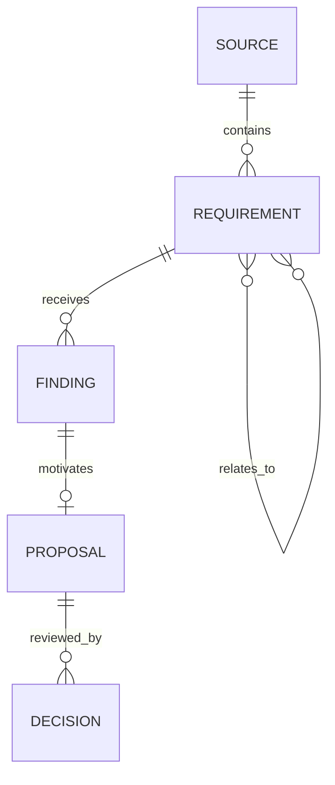

# Traceability and relationship model

## Evidence chain

| Object | Stable identity | Integrity binding |
|---|---|---|
| Source | Manifest source ID and version | File SHA-256 |
| Requirement | Source item ID | Source digest, line, exact text digest |
| Finding | Application-assigned finding ID | Issue type, target IDs, citation digests |
| Proposal | Application-assigned proposal ID | Original digest, proposed text, finding IDs |
| Review artifact | Run ID and schema version | Canonical artifact SHA-256 |
| Decision | Approval record ID | Run, reviewer, artifact digest, round, nonce |
| Export | Export manifest | Approved artifact digest and file digests |

## Relationship rules

- A `DUPLICATE` or `CONTRADICTION` finding names at least two requirement IDs.
- Relationship members must exist and may not reference themselves.
- The relation is symmetric for evaluation even if one item later becomes the
  retained canonical statement.
- A model may suggest a relationship. Only deterministic validation plus human
  confirmation makes it authoritative in a review artifact.
- A missing relationship is reported as a traceability gap; it is not invented
  to complete the graph.

## Frozen relationship examples

These synthetic relations are part of the public benchmark. They demonstrate
the evidence required for a pair finding; they are not supplied to the model
adapter during analysis.

| Relation | Members | Why review is required |
|---|---|---|
| Contradiction | `FR-008`, `BR-001` | Automatic activation conflicts with manual approval for every account. |
| Contradiction | `NFR-006`, `BR-007` | Thirty-day deletion conflicts with seven-year retention for audit events. |
| Contradiction | `US-003`, `BR-008` | Immediate activation conflicts with prior approval for elevated risk. |
| Duplicate | `FR-006`, `FR-016` | Both require the same welcome email within five minutes of activation. |
| Duplicate | `US-002`, `US-008` | Both ask to save and resume an unfinished application. |

## Source-to-item starter

The five evidence documents resolve to 50 stable items:

| Source | Item type | Count | Item range |
|---|---|---:|---|
| `ABS-FR-001` | Functional requirement | 20 | `FR-001`–`FR-020` |
| `ABS-NFR-001` | Non-functional requirement | 10 | `NFR-001`–`NFR-010` |
| `ABS-RULE-001` | Business rule | 10 | `BR-001`–`BR-010` |
| `ABS-US-001` | User story | 10 | `US-001`–`US-010` |

`ABS-BRIEF-001` supplies context and defined terms but no scored requirement
items. The loader derives exact line numbers and text digests rather than
maintaining a second hand-edited copy.
