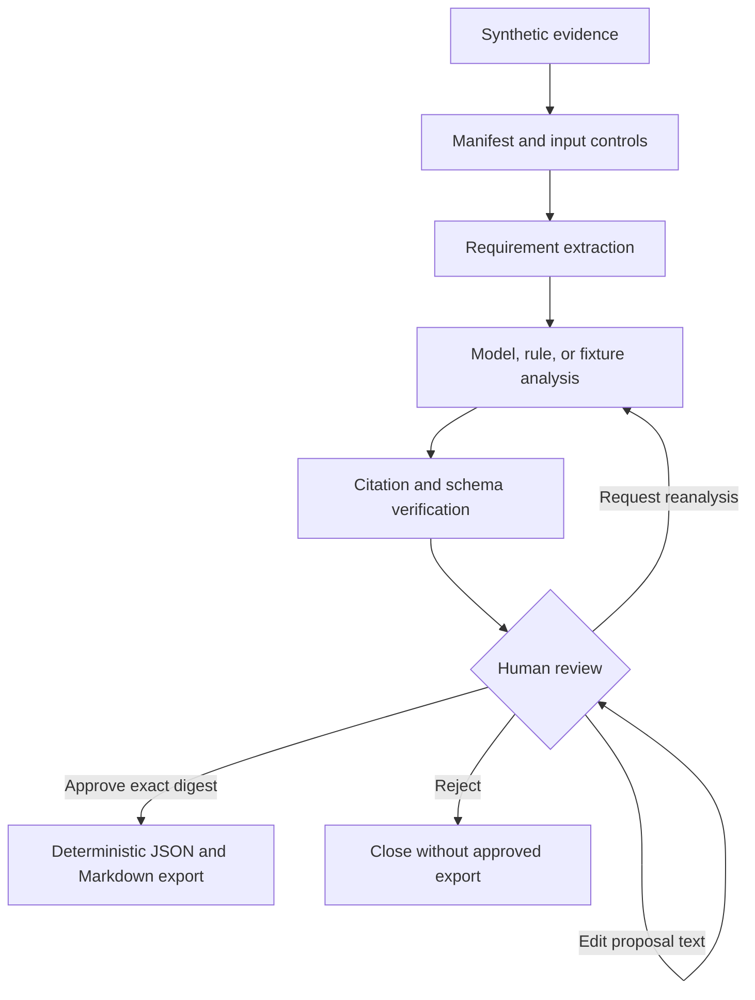

# Agent and control architecture

The application is intentionally one controlled workflow, not a collection of
agents created for appearance. Language interpretation is useful in two places:
finding candidate issues and proposing clearer wording. Every security,
integrity, traceability, and approval decision remains outside the model.



## Dependency direction

```text
presentation -> application/workflow -> domain/controls
                         |             ^
                         v             |
                      adapters --------+
```

- `domain` owns strict types and closed vocabularies.
- `controls` owns pure or bounded deterministic checks.
- `application` owns provider-neutral ports.
- `workflow` owns state orchestration and allowed transitions.
- `adapters` own local files, fixtures, Streamlit, and optional model calls.
- `presentation` composes the application but contains no business authority.

LangGraph is used because its graph model can mix deterministic and model-based
steps while making the state transitions visible. Its official documentation
describes the same combination of deterministic/agentic nodes, persistence, and
human oversight: [LangGraph overview](https://docs.langchain.com/oss/python/langgraph/overview).

## Capability boundary

The model adapter receives text and returns a typed candidate analysis. It has:

- no tools;
- no web access;
- no file-write capability;
- no approval capability;
- no source of reviewer identity; and
- no access to the evaluation answer key.

The first release supports local exports only after approval. It cannot send
mail, update a ticket, commit code, deploy software, or modify a source file.
