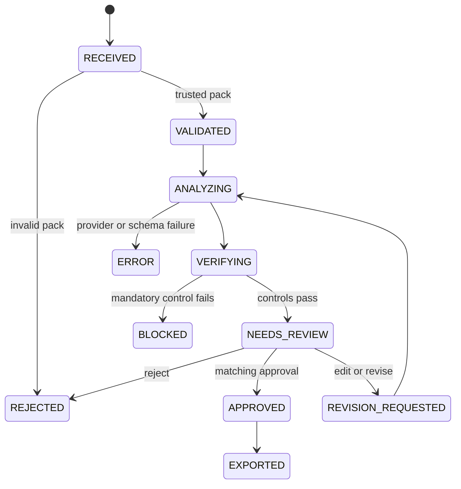

# Workflow and state contract

The code freezes this topology in `workflow/topology.py`. Any unlisted
transition raises an error. Terminal states cannot silently restart.

## Node responsibilities

| Stage | Responsibility | Failure behavior |
|---|---|---|
| Receive | Application | Assign a run ID; accept a repository-root case path only |
| Validate | Deterministic | Reject unsafe paths, unsupported files, invalid UTF-8, or digest mismatch |
| Extract | Deterministic | Reject duplicate IDs or malformed item syntax |
| Analyze | Model or fixture | Reject refusal, timeout, unknown fixture, or schema failure |
| Verify | Deterministic | Resolve exact quotes and block unsupported critical findings |
| Prepare review | Deterministic | Create artifact digest, round, reviewer binding, and nonce once |
| Review | Human | Approve, edit, reject, or request revision |
| Export | Deterministic | Recompute digests and write new local files without overwrite |

LangGraph interrupts can pause and later resume a workflow with a thread ID and
checkpointer. The design follows the official warning that side effects before
an interrupt must be idempotent: [LangGraph interrupts](https://docs.langchain.com/oss/python/langgraph/interrupts).
For the cross-process CLI demonstration, the same pause is additionally stored
as a strict local JSON record so the reviewed digest remains visible.

