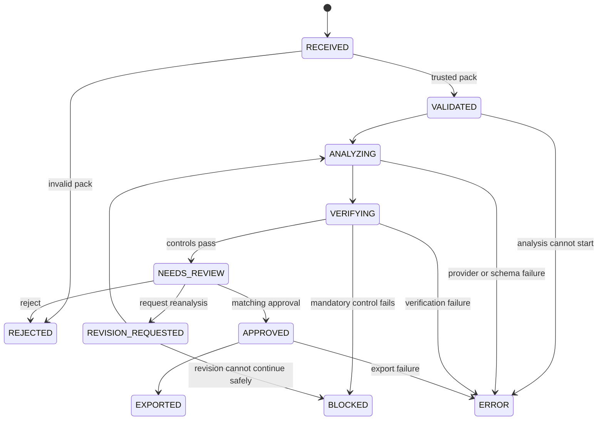

# Workflow and state contract

The code freezes this topology in `workflow/topology.py`. Any unlisted
transition raises an error. Terminal states cannot silently restart.

`EDIT` is deliberately absent from this status-transition diagram. It is an
application-ledger operation: proposal text is changed, a new digest, nonce,
and review round are created atomically, and the persisted status remains
`NEEDS_REVIEW`. It does not rerun analysis or citation verification.

## Node responsibilities

| Stage | Responsibility | Failure behavior |
|---|---|---|
| Receive | Application | Assign a run ID; accept a repository-root case path only |
| Validate | Deterministic | Reject unsafe paths, unsupported files, invalid UTF-8, or digest mismatch |
| Extract | Deterministic | Reject duplicate IDs or malformed item syntax |
| Analyze | Model, rule, or fixture | Reject refusal, timeout, unknown fixture, or schema failure |
| Verify | Deterministic | Resolve exact quotes and block unsupported critical findings |
| Prepare review | Deterministic | Create artifact digest, round, reviewer binding, and nonce once |
| Review | Human | Approve, edit, reject, or request revision |
| Export | Deterministic | Recompute digests and write new local files without overwrite |

The first release uses LangGraph for validation, analysis, verification, and
failure routing. It deliberately ends that graph after preparing the review
request. A separate application-owned JSON ledger persists the cross-process
decision boundary atomically. `REQUEST_REVISION` starts a new graph execution
for the same run and next review round.

This is an application-managed pause/resume boundary, not a LangGraph-native
`interrupt()` checkpoint. The distinction is documented because implying a
native interrupt would overstate the implementation. A later version may adopt
a durable LangGraph checkpointer if it preserves the same digest, nonce, and
transaction controls.
